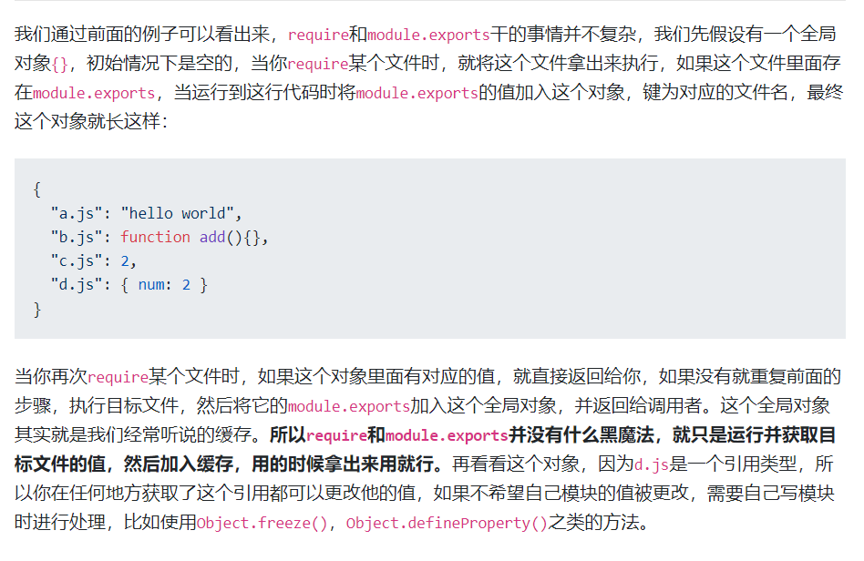

# 全局对象和模块化开发

## 目录

- [全局对象和模块化开发](#全局对象和模块化开发)
  - [目录](#目录)
  - [全局对象](#全局对象)
    - [特殊的全局对象](#特殊的全局对象)
    - [常见的全局对象](#常见的全局对象)
  - [模块化](#模块化)
    - [CommonJS 和 Node](#commonjs-和-node)
      - [Node 对 CommonJS 进行了支持和实现](#node-对-commonjs-进行了支持和实现)
    - [理解 CommonJS](#理解-commonjs)
      - [对于 module](#对于-module)
      - [module.exports 和 exports](#moduleexports-和-exports)
      - [为什么 NodeJS 要拥有 exports](#为什么-nodejs-要拥有-exports)

## 全局对象

### 特殊的全局对象

为什么称之为特殊的全局对象？

这些全局对象实际上是模块中的变量，只是每个模块都有，看起来像是全局变量

在命令好交互中不可以使用

包括：

- __dirname
- __filename
- exports
- moudule
- reuqire()

### 常见的全局对象

- process 对象
  - process 提供了 Node 进程中相关的信息
    - Node 的运行环境、参数信息等
    - 可以将一些环境变量读取到 process 的 env 中
- console 对象
  - 提供了简单的调试控制台
- 定时器函数
  - setTimeout(callback, delay[,...args])
    - callback 在 delay 毫秒后执行一次
  - clearTimeout(name)
    - 清除 name 对应的 setTimeout()
  - setInterval(callback, delay[,...args])
    - callback 每 delay 毫秒重复执行一次
  - clearInterval(name)
    - 清除 name 对应的 setInterval()
  - setImmediate(callback, delay[,...args])
    - callback I/O 事件后的回调“立即”执行
  - clearImmediate(name)
    - 清除 name 对应的 setImmediate()
  - process.nextTick(callback, [,...args])
    - 将 callback 添加到下一次 tick 队列中
- global 对象
  - 与浏览器 window 区别
    - 在浏览器中执行 JS 代码，如果该代码中在顶级作用域长通过 var 定义一个变量，该变量会默认作为属性添加到 window 对象中
    - 在 node 中，通过 var 定义一个变量，它只是在当前模块中拥有该变量，不会放到全局对象中

## 模块化

- AMD
- CMD
- CommonJS
- ESM

### CommonJS 和 Node

CommonJS 作为一个规范，最初命名为 ServerJS，是用于浏览器以外的地方，后为体现其广泛性遂修改为 CommonJS。

- Node 是 CommonJS 在服务端一个具有代表性的实现。
- Webpack 具备对 CommonJS 的支持和转换

#### Node 对 CommonJS 进行了支持和实现

- 在 Node 中，每一个 js 文件都是一个单独的模块
- 每个模块都包括 CommonJS 规范的核心变量
  - exprots
  - module.exprots
  - require
- 可以使用上述变量进行模块化开发

### 理解 CommonJS

#### 对于 module

Node 底层使用 Module 类进行实现，每个 module 是 Module 类的一个实例。

#### module.exports 和 exports

对于 exports 在 Node 源码中进行了如下操作：

```javascript
module.exports = exports;
```

module.exports 是真正的导出数据者。

对于 CommonJS 规范中，每个 JS 文件都是一个 module，而 exports 属性可以理解为是每个 module 的信箱，信箱里放着该 module 向外界暴露的数据。

require() 做了什么？



```javascript
// main.js
const name = "huaqi";
const age = 18;
exports {
    name,
    age
}


// bar.js
const main = require("./main.js");
// 此处的 main 实际上是 main 模块的 exports 对象的浅层拷贝（引用赋值）
```

#### 为什么 NodeJS 要拥有 exports

CommonJS 规范要求使用 exports 对数据进行导出。
