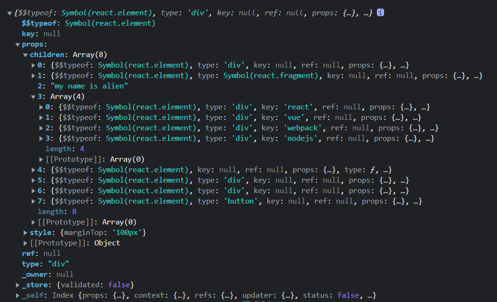

# 认识 JSX

## 目录

- [认识 JSX](#认识-jsx)
  - [目录](#目录)
  - [React.createElement](#reactcreateelement)
    - [Q&A](#qa)
  - [jsx 到 react.createElement 转换规则](#jsx-到-reactcreateelement-转换规则)
  - [React 底层调和处理后，jsx 会变成什么？](#react-底层调和处理后jsx-会变成什么)
    - [不同 React Element 对应的 fiber tag](#不同-react-element-对应的-fiber-tag)
    - [jsx 最终形成的 fiber 结构图](#jsx-最终形成的-fiber-结构图)
  - [进阶实践--可控性 render](#进阶实践--可控性-render)
    - [1. Rreact.Chilren.toArray 扁平化,规范化 children 数组](#1-rreactchilrentoarray-扁平化规范化-children-数组)
    - [2. 遍历 children， 验证 React element 元素节点，去除文本节点](#2-遍历-children-验证-react-element-元素节点去除文本节点)
    - [3. 使用 React.createElement() 创建节点，并插入到 newChildren](#3-使用-reactcreateelement-创建节点并插入到-newchildren)
    - [4. 通过 cloneElement() 创建新的容器元素](#4-通过-cloneelement-创建新的容器元素)

## React.createElement

```javascript
React.createElement(
    type, 
    [props],
    [...children]
)
```

createElement 参数:

1. 第一个参数
   - 如果是组件类型，会传入组件对应的类或函数
   - 如果的 dom 元素类型，传入 div 或者 span 之类的字符串
2. 第二个参数（一个对象）
   - 在组件类型中为 props
   - 在 dom 类型中为标签属性
3. 其他参数
   - 依次为 children，根据顺序排列

举个例子：

```js
<div>
    <TextComponent />
    <div>hello, world</div>
    let us learn React!
</div>

// 上述代码会被 babel 编译为
React.createElement("div", null, 
    React.createElement(TextComponent, null),
    React.createElement("div", null, "hello, world"),
    "let us learn React!"
    )
```

### Q&A

问：老版本的 React 中，为什么写 jsx 的文件要默认引入 React？

如下：

```javascript
import React from 'react'
function Index() {
    return <div>hello, world</div>
}
```

答：因为 jsx 在被 babel 编译后，jsx 会变为上述 React.createElement() 形式，所以需要引入 React，防止找不到 React 引起报错。

## jsx 到 react.createElement 转换规则

类组件执行 render() 方法时，JSX 代码即会转变为 React.createElement() 然后返回函数处理结果



| jsx 元素类型                   | react.createeElement 转换后                       | type 属性                  |
| :----------------------------- | :------------------------------------------------ | :------------------------- |
| element 元素（或称 HTML 标签） | react element 类型                                | 标签字符串，例如 div       |
| fragment 类型                  | react element 类型                                | Symbol react.fragment 类型 |
| 文本类型                       | 字符串                                            | 无                         |
| 数组类型                       | 返回数组结构，数组元素被 react.createElement 转换 | 无                         |
| 组件类型                       | react element 类型                                | 组件类或组件函数本身       |
| 三元运算/表达式                | 先执行三元运算，然后按照上述规则处理              | 根据三元运算结果设定类型   |
| 函数执行                       | 先执行函数，然后按照上述规则处理                  | 根据函数执行结果设定类型   |

## React 底层调和处理后，jsx 会变成什么？

在**调和阶段**，上述的 React Element 对象会形成与之对应的 **fiber** 对象，然后通过 sibling、return、child 关系链将每一个 fiber 对象联系起来。

React 常用的 fiber 类型，以及 React Element 对象和 fiber 对象的对应关系。

### 不同 React Element 对应的 fiber tag

React 根据不同的 React Element 对象会产生不同 tag（种类）的 fiber 对象。

```javascript
export const FunctionComponent = 0;       // 函数组件
export const ClassComponent = 1;          // 类组件
export const IndeterminateComponent = 2;  // 初始化的时候不知道是函数组件还是类组件 
export const HostRoot = 3;                // Root Fiber 可以理解为根元素 ， 通过 ReactDom.render()产生的根元素
export const HostPortal = 4;              // 对应  ReactDOM.createPortal 产生的 Portal 
export const HostComponent = 5;           // dom 元素 比如 <div>
export const HostText = 6;                // 文本节点
export const Fragment = 7;                // 对应 <React.Fragment> 
export const Mode = 8;                    // 对应 <React.StrictMode>   
export const ContextConsumer = 9;         // 对应 <Context.Consumer>
export const ContextProvider = 10;        // 对应 <Context.Provider>
export const ForwardRef = 11;             // 对应 React.ForwardRef
export const Profiler = 12;               // 对应 <Profiler/ >
export const SuspenseComponent = 13;      // 对应 <Suspense>
export const MemoComponent = 14;          // 对应 React.memo 返回的组件
```

### jsx 最终形成的 fiber 结构图


fiber 对应关系

- child
  - 一个由父级 fiber 指向子级 fiber 的指针
- return
  - 一个由子级 fiber 指向父子 fiber 的指针
- sibling
  - 一个由 fiber 指向下一个兄弟 fiber 的指针（按照代码书写顺序）

注：

- 对于上述在 jsx 中包含在 map 数组结构的子节点，外层会被加上 fragment
- map 返回数组结构，作为 fragment 的子节点

## 进阶实践--可控性 render

上述 demo 暴露出了如下问题：

1. 返回的 children 虽然是一个数组，但是数组里面的数据类型却是不确定的，有对象类型（如 ReactElement）,有数组类型（如 map 遍历返回的子节点），还有字符串类型（如文本）
2. 无法对 render 后的 React element 元素进行可控性操作

针对上述问题，需要对 demo 项目进行改造处理，具体过程可以氛围 4 步：

1. 将上述 children 扁平化处理，将数组类型的子节点打开
2. 去除 children 里文本类型节点
3. 在 children 最后插入 say goodbye 元素
4. 克隆新的元素节点并渲染

### 1. Rreact.Chilren.toArray 扁平化,规范化 children 数组

```javascript
const flatChildren = React.Children.toArray(children);
console.log(flatChildren)
```

React.Children.toArray 可以扁平化、规范化 React element 的 children 组成的数组，children 中的数组元素被打开，对遍历 children 很有帮助

**注**：React.Children.toArray 可以深层次 flat

### 2. 遍历 children， 验证 React element 元素节点，去除文本节点

```javascript
const newChildren = [];
React.Children.forEach(flatChildren, item => {
    if (React.isVaildElemnt(item)) {
        newChildren.push(item)
    }
})

// 数组本身的 filter
const newChildren = flatChildren.filter(
    item => React.isVaildElement(item)
    )
```

使用 React.Children.forEach() 方法遍历子节点，如果是 React element 元素，就添加到新的 children 数组中，通过这种方式过滤掉非 React element 节点。

React.isValidElement() 方法可以用于检测参数是否为 React element 元素，结果为 boolean

这种情况下，是完全可以用数组方法过滤的，因为 React.Children.toArray 已经使 children 变成了正常的数组结构。

而 React.Children.forEach() 本身就可以把 children 扁平化，即 React.Children.forEach() = React.Children.toArray() + Array.prototypr.forEach()

### 3. 使用 React.createElement() 创建节点，并插入到 newChildren

```javascript
const lastChild = React.createElement('div', {className: "last"}, 'say goodbye');
newChildren.push(lastChild);

// 上述代码等同于
newChildren.push(<div className="last">say goodbye</div>)
```

### 4. 通过 cloneElement() 创建新的容器元素

- React.createElement()
  - 依据 jsx 代码，创建新的 React element
- React.cloneElement()
  - 依据已有的 React element，创建新的 React element
  - 新的 Rreact element 的 props 是新添加 props 与 原始元素的 props **浅层合并**后的结果

```javascript
const newReactElement = React.cloneElement(reactElement, {}, ...newChildren);
```
