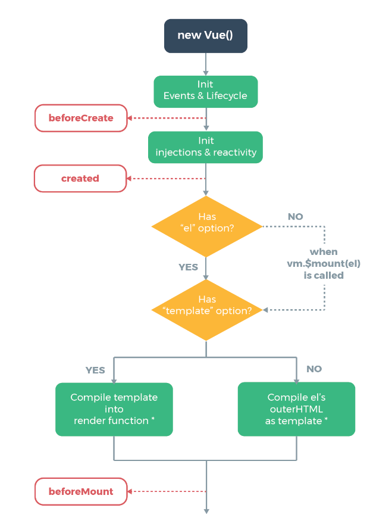
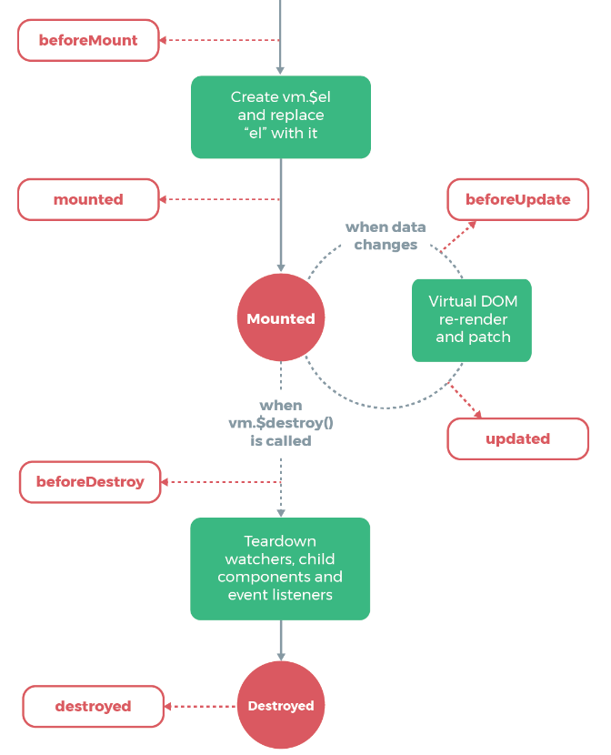

# Vue 实例

## 目录

- [Vue 实例](#vue-实例)
  - [目录](#目录)
  - [创建一个 Vue 实例](#创建一个-vue-实例)
  - [数据与方法](#数据与方法)
  - [实例声明周期钩子](#实例声明周期钩子)
  - [生命周期图示](#生命周期图示)

## 创建一个 Vue 实例

每个 Vue 应用都是通过 Vue 函数创建的一个新的 Vue 实例开始的。

当创建一个 Vue 实例时，可以传入一个**选项对象**。

若想要使用这些选项创建想要的行为，可以参考 [API 文档](https://v2.cn.vuejs.org/v2/api/#%E9%80%89%E9%A1%B9-%E6%95%B0%E6%8D%AE/#选项-数据)

```javascript
const vm = new Vue({
    // 选项
})
```

一个 Vue 应用**由一个通过 new Vue 创建的根 Vue 实例**，以及**可选的嵌套的、可复用的组件树**组成。

举个栗子，一个 todo 应用的组件树可以如下这样：

```shell
根实例
└─ TodoList
   ├─ TodoItem
   │  ├─ TodoButtonDelete
   │  └─ TodoButtonEdit
   └─ TodoListFooter
      ├─ TodosButtonClear
      └─ TodoListStatistics
```

所有的 Vue 组件都是 Vue 实例，并且接受相同的选项对象（一些根实例特有的选项除外）。

---

## 数据与方法

当一个 Vue 实例被创建时，会将其 data 对象中的所有 property 加入到 Vue 的**响应式系统**中。

当 property 的值改变时，视图会进行重渲染。

伪代码示意：

```javascript
// 数据对象
const data = { a: 1 };

// 将上述对象加入到一个 Vue 实例中
const vm = new Vue({
    data: data
})

// 获得这个实例上的 property
// 返回源数据中对应的字段
vm.a === data.a; // => true
```

**注**：只有实例被创建时就已存在于 data 中的 property 才是**响应式**的。

若 property 需要在实例化后被使用，但是其实例化时并不存在或为空，那么需要为其设置一些初始值。

```javascript
data: {
    newTodoText: "",
    visitCount: 0,
    hideCompletedTodos: false;
    todos: [],
    error: null;
}
```

**注**：若使用 Object.freeze() 对数据对象进行处理，会阻止修改现有的 property，也意味着**响应式系统无法再追踪变化**。

```html
<div id="app">
    <p>{{ foo }}</p>
    <!-- 这里的 "foo" 不会更新 -->
    <button v-on:click="foo = 'baz'">Change it</button>
</div>

<script>
    const obj = {
        foo: "bar"
    };

    // 对象冻结
    Object.freeze(obj);

    new Vue({
        el: "#app",
        data: obj;
    })

</script>
```

除了数据 property，Vue 实例还暴露了一些有用的实例 property 与方法。它们都有前缀 $，以便于用户自定义的 property 区分开来。

```javascript
const data = { a: 1 };
const vm = new Vue({
    el: "#example",
    data: data;
})

vm.$data === data; // => true
vm.$el === document.getElementById("example"); // => true

// $watch 是一个实例方法
vm.$watch("a", function(newValue, oldValue)) {
    // 这个回调将在 vm.a 改变后被调用
}
```

完整的实例 property 和方法列表，请移步 [API 参考](https://v2.cn.vuejs.org/v2/api/#%E5%AE%9E%E4%BE%8B-property)

---

## 实例声明周期钩子

每个 Vue 实例在被创建时都要经过一系列的初始化过程，例如：设置数据监听、编译模板、将实例挂载到 DOM 并在数据变化时更新 DOM 等。

同时这个过程中也会运行一些叫做**生命周期钩子**的函数，用户可以在不同阶段添加自己的代码。

比如 created() 钩子函数用于在一个实例被创建之后执行代码。

```javascript
new Vue({
    data: {
        a: 1
    },
    created: function() {
        // this 指向 vm 实例
        console.log(`a is: ${this.a}`)
    }   
})

// => "a is: 1"
```

诸如 mounted、updated、destroyed 等都属于生命周期函数，生命周期钩子的 this 上下文指向调用它的 Vue 实例。

> 不要在选项 property 或回调上使用**箭头函数**，诸如下例：</br>
> created: () => console.log(this.a) </br>
> vm.$watch("a", newValue => this.myMethod()) </br>
> 因为箭头函数并没有 this，this 会作为变量一直向上级词法作用域中查找，直到找到为止，会导致报错 </br>
> Uncaught TypeError: Cannot read property of undefiend </br>
> Uncaught TypeError: this.myMethod is not a function </br>

---

## 生命周期图示




