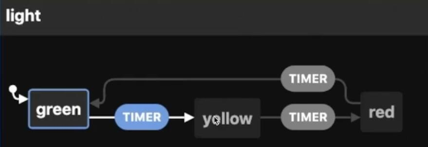

# 响应式系统与 React

## 目录

- [响应式系统与 React](#响应式系统与-react)
  - [目录](#目录)
  - [React 的历史与应用](#react-的历史与应用)
  - [React 的设计思路](#react-的设计思路)
    - [UI 编程痛点](#ui-编程痛点)
    - [响应式与转换式](#响应式与转换式)
    - [响应式编程](#响应式编程)
    - [组件化 -- 总结](#组件化----总结)
    - [状态归属问题](#状态归属问题)
    - [组件设计](#组件设计)
  - [React （hooks）的写法](#react-hooks的写法)
    - [useState()](#usestate)
    - [useEffect()](#useeffect)
      - [什么是副作用？](#什么是副作用)
  - [React 的实现](#react-的实现)
    - [Virtual DOM（虚拟 DOM）](#virtual-dom虚拟-dom)
    - [How to Diff?](#how-to-diff)
  - [React 状态管理库](#react-状态管理库)
    - [推荐使用](#推荐使用)
    - [状态机](#状态机)
    - [什么状态适合放在 Store](#什么状态适合放在-store)
    - [应用级框架科普](#应用级框架科普)
  - [思考](#思考)
    - [Vue、React、Angular 等前端框架既然都是声明式编程，为什么不直接在浏览器支持声明式编程呢？](#vuereactangular-等前端框架既然都是声明式编程为什么不直接在浏览器支持声明式编程呢)
  - [课后答疑](#课后答疑)
    - [代码开发注意事项](#代码开发注意事项)
    - [useMemo() hook 使用](#usememo-hook-使用)
    - [React 这种函数式编程 JS 库和 Vue 这种基于模板语法的前端框架，各有什么优势？](#react-这种函数式编程-js-库和-vue-这种基于模板语法的前端框架各有什么优势)
    - [React 推荐使用组合来进行组件的复用，而不是继承，背后有什么样的考虑？](#react-推荐使用组合来进行组件的复用而不是继承背后有什么样的考虑)

---

## React 的历史与应用

- 前端应用开发
  - 如：FaceBook、Instagram、Netflix
- 移动原生应用开发
  - 如：Instagram、Discord、Oculus
- 桌面应用
  - 结合 Electron 开发
- 浏览器 3D 渲染
  - 结合 react-three-fiber 框架开发

**React**：A JavaScript library for building user interfaces.

---

## React 的设计思路

### UI 编程痛点

1. 状态更新，UI 不会自动更新，需要手动更新 DOM。
2. 欠缺基本的代码层面的封装和隔离，代码层面没有组件化。
3. UI 之间的数据依赖关系，需要手动维护，如果依赖链路过长，则会遇到 “Callback Hell”。

### 响应式与转换式

- 响应式系统
  - 注重：监听事件，消息驱动
  - 比如：监控系统、UI 界面
- 转换式系统
  - 注重：给定【输入】求解【输出】
  - 比如：编译器、数值计算
  
- 响应式系统
  - 事件 ---> 执行既定回调 ---> 状态变更
- 前端 UI
  - 事件 ---> 执行既定回调 ---> 状态变更 ---> UI 更新

### 响应式编程

1. 状态更新，UI 自动更新。
2. 前端代码组件化，可复用，可封装
3. 状态之间的互相依赖关系，只需声明即可。

### 组件化 -- 总结

- 组件是 组件的组合/原子组件
- 组件内拥有状态，外部不可见
- 父组件可将状态传入组件内部

### 状态归属问题

**思考**：

1. Reacy 是单向数据流，还是双向数据流。？
   - 单向数据流，数据只能由父组件传至子组件，子组件可通过父组件传递的函数更改该数据。
2. 如何解决状态不合理上升的问题？
3. 组件的状态改变后，如何更新 DOM？
   - [React 的实现](#react-的实现)

### 组件设计

1. 组件声明了状态和 UI 的映射。
   - 组件根据当前 State/Props 与 UI 的映射更改 UI。
2. 组件具有 Props/State 两种状态。
   - 组件内部拥有私有状态 State。
   - 组件接收外部的 Props 状态提供复用性。
3. “组件”可由其他组件拼装而成。

---

## React （hooks）的写法

### useState()

``` js
import { useState } from 'react';

const [count, setCount] = useState(0);
```

### useEffect()

#### 什么是副作用？

一个操作会更改组件外部的状态，该操作即是副作用。

```js
import { useEffect } from 'react';

useEffect(() => {
    // 组件挂载/更新时，执行的副作用操作

    return () => {
        // 组件卸载时执行的副作用操作/清除订阅
    }
})
```

**注**：不要在循环、条件或嵌套函数中调用 Hook。

---

## React 的实现

1. 如何解决 JSX 不符合 JS 的标准的问题？
   - 将 JSX 转译为 JS
2. 返回的 JSX 发生改变时，如何更新 DOM ？
   1. JSX 的改变会引起 [Virtual DOM](#virtual-dom虚拟-dom) 的改变
   2. 对改变前后的 Virtual DOM 进行 Diff（[How to Diff?](#how-to-diff)）
   3. 根据 Virtual DOM 与 DOM 的映射关系，进而更新 DOM
3. react 组件的 render 函数，在哪些情况下，会被重新执行？
   - 当组件的状态（Props/State）发生改变时，组件和其所有的子组件，会递归地重新执行 render 函数。

### Virtual DOM（虚拟 DOM）

**注**：DOM 由浏览器维护，可通过 DOM API 进行修改。

Virtual DOM 是一种用于和真实 DOM 同步，而在 JS 内存中维护的一个对象，它具有和 DOM 类似的树状结构，并可以和 DOM 建立一一对应的关系。

Virtual DOM 赋予了 React 声明式的 API：您告诉 React 希望让 UI 是什么状态，React 就确保 DOM 匹配 该状态。这使您可以从属性操作、事件处理和手动 DOM 更新这些在构建应用程序时必要的操作中解放出来。

- 指令式编程
- 声明式编程
  - 响应式编程（声明式的一个类别）

### How to Diff?

render 函数执行速度（即 diff 速度）要足够快 <-- TradeOff --> DOM 更新的次数/节点足够少（即 diff 节点足够少）

完美的最小 Diff 算法，需要 O(n^3) 的复杂度。

牺牲理论最小 Diff,换取时间，得到 O(n) 复杂度的算法：Heuristic O(n) Algorithm

- 不同类型的元素 -- 替换
- 同类型的 DOM 元素 -- 更新
- 同类型的组件元素 -- 递归
  - 而组件根节点的类型发生变化时，会引起组件所有子节点递归地发生变化，这是很消耗性能的，如何解决这种问题？
    - 当根节点为不同类型的元素时，React 会拆卸原有的树并且建立起新的树，不再进行递归 diff。

---

## React 状态管理库

React 状态管理库 - 核心思想：**将状态抽离到 UI 外部进行统一管理**，将状态保存在 Store。

状态全部抽离到 UI 外部的弊端：组件与 Store 强耦合，不适用于 library 的开发，在业务代码中可以将组件公用状态防止在 Store 中

### 推荐使用

- redux
- xstate
- mobx
- recoil

### 状态机

当前状态，收到外部事件，迁移到下一状态。

交通灯即是一个状态机:



### 什么状态适合放在 Store

**准则**：该状态是否被整个 app 使用。

比如 client user info 应该放置于 Store 中。

---

### 应用级框架科普

- NEXT.JS
  - 硅谷明星创业公司 Vercel 的 React 开发框架，稳定，开发体验好，支持 Unbundled Dev, SWC 等，其同样有 Serverless 一键部署平台帮助开发者快速完成部署。口号是“Let`s Make Web Faster”。
- MODERN.JS
  - 字节跳动 Web Infra 团队研发的全栈开发框架，内置了很多开箱即用的能力与最佳实践，可以减少很多调研选择工具的时间。
- Blitz
  - 无 API 思想的全栈开发框架，开发过程无需写 API 调用与 CRUD (Create、Update、Retrieve、Delete) 逻辑，适合前后端紧密联系的小团队项目。

---

## 思考

### Vue、React、Angular 等前端框架既然都是声明式编程，为什么不直接在浏览器支持声明式编程呢？

浏览器直提供底层的东西，不会因为如今声明式编程的流行，而全部改为声明式编程，它也要兼顾到指令式编程的开发者。

同理，浏览器不会提供更高层的事务，这会是浏览器的开发自由度降低。

开发者可根据自己的需要进行封装，以适应浏览器。

---

## 课后答疑

### 代码开发注意事项

高聚合、低耦合以及关注“信任问题”。

信任问题：比如我声明的函数不知道会被谁调用，那么我应该进行诸如类型检测等安全措施。

### useMemo() hook 使用

使用 useMemo() 的组件，在 rerender 时，只会重新声明更改的状态/数据，其他状态/数据不会重新声明，进而提高 app 性能。

### React 这种函数式编程 JS 库和 Vue 这种基于模板语法的前端框架，各有什么优势？

- React 优点
  - React 的开发本身是 jsx，开发时具有高自由度。
  - React 调试更方便。
- Vue 优点
  - vue 的写法更容易收敛。

### React 推荐使用组合来进行组件的复用，而不是继承，背后有什么样的考虑？

[推荐文章](https://www.zhihu.com/question/21862257/answer/181179184)
