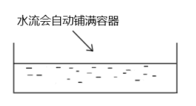
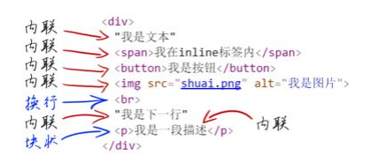

# width/height 作用的具体细节

因为块级元素的流体特性主要体现在水平方向上，所以这里先着重讨论 width。

## 目录

- [width/height 作用的具体细节](#widthheight-作用的具体细节)
  - [目录](#目录)
    - [深藏不露的 width: auto](#深藏不露的-width-auto)
      - [外部尺寸与流体特性](#外部尺寸与流体特性)
        - [**正常流宽度**](#正常流宽度)
        - [**格式化宽度**](#格式化宽度)
      - [内部尺寸与流体特性](#内部尺寸与流体特性)
        - [**包裹性**](#包裹性)
        - [**首选最小宽度**](#首选最小宽度)
        - [**最大宽度**](#最大宽度)

### 深藏不露的 width: auto

auto 作为 width 的默认值，至少包含了以下4中不同的宽度表现。

1. 充分利用可用空间
   - 块级元素的宽度，默认 100% 于父级容器
   - 这种充分利用可用空间的行为，叫作 fill-available
2. 收缩与包裹
   - 典型代表：浮动、绝对定位、inline-block、table元素
   - shrink-to-fit（收缩到合适），笔者称之为“包裹性”
   - CSS3 中称为 fit-content
3. 收缩到最小
   - 最容易出现在 table-layout: auto 的表格中
   - 当每一列空间都不够的时候，文字能断就断，中文随便断，英文单词不能断
   - CSS3 中称为 min-content
4. 超出容器限制
   - 上述三种情况中，除非有明确的 width 相关设置，否则都不会主动超过父级容器宽度
   - 存在特殊情况
     - 内容很长的连续英文或数字
     - 内联元素设置为 white-space: nowrap
   - CSS3 中称为 max-content

在 CSS 世界中

- 盒子
  - 内在盒子
  - 外在盒子
- 显示
  - 内部显示
  - 外部显示
- 尺寸分为
  - 内部尺寸（Intrinsic Sizing）
    - 尺寸由内部元素决定
  - 外部尺寸（Extrinsic Sizing）
    - 尺寸由外部元素决定

对于上述 width: auto 的四种表现，只有第一个“充分利用可用空间”，是“外部尺寸”，其余全部是“内部尺寸”。

#### 外部尺寸与流体特性

##### **正常流宽度**

当在一个容器里导入足量的水时，水一定会均匀铺满整个容器。



当在页面中使用 \<div> 元素时，其尺寸表现就会和水流一样铺满容器。这就是 block 容器的特性，在所有浏览器中表现一致。

为设置垂直导航，对于如下 CSS 代码：

```css
a {
    display: block;
    width: 100%;
}
```

\<a> 元素默认 display: inline，所以设置 display: block 使其块状化绝对没有任何问题，但是设置 width: 100% 没有任何必要。

作者总结过的一套“鑫三无准则”，即“无宽度，无图片，无浮动”。为何要“无宽度”？

原因：表现为“外部尺寸”的块级元素一旦设置了宽度，流动性就丢失了。

所谓流动性，并不只是宽度100%显示，而是一种 margin/border/padding 和 content 内容区域自动分配水平空间的机制。

[block 元素的流动性对比示例](https://demo.cssworld.cn/3/2-3.php)

[block 元素的流动性对比示例 - 备份](demo/00-block元素的流动性.html)


上下两个导航均有 margin 和 padding，前者无 width 设置，完全借助流特性；后者 width: 100%

当然对于导航栏的宽度可以计算出来：

```css
.nav {
    width: 240px;
}

.nav-a {
    display: block;
    /* 200px = 240px - 10px * 2 - 10px * 2 */
    width: 200px;
    margin: 10px;
    padding: 9px 10px;
}
```

对于上述手动计算方式，弊端可想而知。

因此对于“无宽度”这条准则，少了代码，少了计算，少了维护，何乐而不为呢？

##### **格式化宽度**

格式化宽度仅出现在**绝对定位模型**中，即设置 position: absolute/fixed 的元素中。

在默认情况下，绝对定位元素的宽度表现为“包裹性”：**宽度由内部尺寸决定**。

但是，有一种情况其宽度是由外部尺寸决定的。

对于**非替换元素**，当 left/right 或 top/bottom 对立方位的属性值同时存在时，元素的宽度表现为**格式化宽度**，其宽度大小相对于最近的具有定位特性（position 属性值不为 static）的祖先元素计算。

代码示例：

```css
.parent {
    position: relative;
    width: 1000px;
}

.child {
    position: absolute;
    left: 20px;
    right: 20px;
}
```

根据上述关于格式化宽度的描述，.child 元素的宽度为 960px（1000-20-20）。

**格式化宽度**具有完全的流体性，即margin、border、padding 和 content 内容区域同样会自动分配水平（和垂直）空间。

#### 内部尺寸与流体特性

所谓“内部尺寸”，简单来说就是元素的尺寸由内部的元素决定，而非由外部的容器决定。

如何判断一个元素是否使用“内部尺寸”？

如果在该元素内没有内容的情况下，宽度为 0，那就是应用的“内部尺寸”。

##### **包裹性**

“包裹性”是作者对“shrink-to-fit”理解后的一种称谓。

具有包裹性的元素：

- inline-block 元素
- 浮动元素
- 绝对定位元素

包裹性，除了包裹，还有自适应性。

**自适应性**，指的是元素尺寸由内部元素决定，但永远小于“包含块”容器的尺寸（除非容器尺寸小于元素的“首选最小宽度”）。

因此，如果一个元素设置 display: inline-block，那么即使它里面的内容再多，只要是正常文本，宽度永远不会超过容器。

包裹性示例：CSS 极具代表性的 inline-block 元素--按钮。

具体表现为：按钮文字越多，宽度越宽（内部尺寸特性），但如果文字足够多，则会在容器的宽度处自动换行（自适应特性）。

注意：\<button>标签按钮才会自动换行，\<input> 标签按钮默认设置 white-space: pre，不会自动换行，需将 pre 重置为 normal。

**“包裹性”对实际开发有什么作用？**

需求：页面某个模块的文字内容是动态的，字数不定，希望在文字少的时候居中显示，文字超过一行时左对齐。

[按钮元素“包裹性”实例](https://demo.cssworld.cn/3/2-5.php)

[按钮元素“包裹性”实例 - 备份](demo/01-包裹性实例.html)

##### **首选最小宽度**

首选最小宽度，指的是元素最适合的最小宽度。

在 CSS 世界中，图文和文字的权重远大于布局，因此CSS的设计者显然不会让图文在 width: auto 时宽度变为0，此时所表现的宽度就是“首选最小宽度”。

具体规则如下：

东亚文字（如中文）最小宽度为每个汉字的宽度


西方文字最小宽度由特定的连续英文字符单元决定，并不是所有的英文字符都会组成连续单位，一般会终止于**空格（普通空格）、短横线、问好以及其他非英文字符**等。


**注**：如果想让英文字符和中文一样，最小宽度单元为字符宽度，可以设置 word-break: break-all

类似图片这样的**替换元素**的最小宽度就是该元素内容本身的宽度。

**“首选最小宽度”对我们实际开发有什么作用？**

开发中遇到类似现象的时候知道原因是什么，方便对症下药。

可以利用“首选最小宽度”构建图形，当然可以使用 CSS3 盒阴影以及背景渐变或其他方式。


具体代码见链接：

[“首选最小宽度”与凹凸效果实例](https://demo.cssworld.cn/3/2-6.php)

[“首选最小宽度”与凹凸效果实例 - 备份](demo/02-首选最小宽度实例.html)

##### **最大宽度**

最大宽度就是元素可以有的最大宽度，根据作者理解，“最大宽度”实际等同于“包裹性”元素设置 white-space: nowrap 声明后的宽度。

如果内部没有块级元素或者块级元素没有设定宽度值，则“最大宽度”实际上是最大的连续内联盒子的宽度。

什么是连续内联盒子？

可以将**内联盒子**简单地理解为 display: inline/inline-block/inline-table 等元素。

**连续内联盒子**，指全部都是内联级别的一个或一堆元素，中间没有任何的换行标签\<br> 或其他块级元素。

如图所示：



标注图中最大宽度就是最开始的4个连续内联元素的总宽度


**“最大宽度”对实际开发有什么作用呢？**

大部分需要使用“最大宽度”的场景都可以通过设置一个“很大宽度”来实现。

注意最大宽度和很大宽度的区别：有5张宽度为 200px 的图片，假设图片元素紧密排列，则“最大宽度”就是 1000px。但是在实际开发时，可能直接设置容器 width: 2000px，此时 2000px 就是“很大宽度”，宽度足够大，保证图片不会因为容器宽度不足而不在一行内显示。
