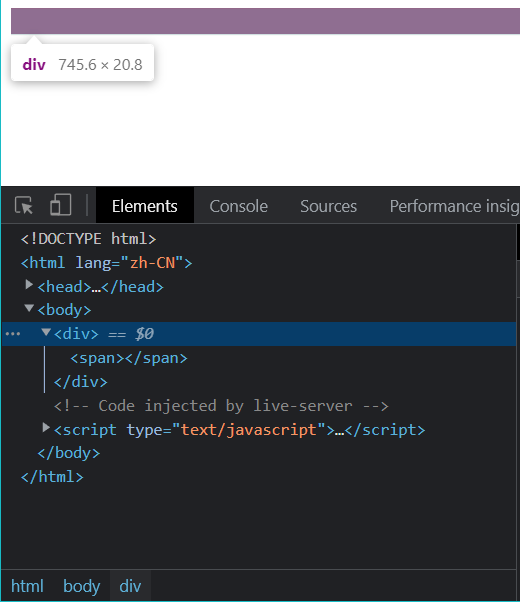

# 内联元素

前文在讨论元素的内外盒子时，曾提到过“外在盒子”有 inline、block 和 run-in（鲜有人使用，有淘汰风险）。

inline 和 block 是**流体布局的本质所在**。

从作用角度来看，block 负责结构、inline 负责内容。

## 目录

- [内联元素](#内联元素)
  - [目录](#目录)

## 哪些元素是内联元素

### 从定义看

若元素的外在盒子为 inline，则该元素为内联元素，与设置为 display: inline 的元素不是一个概念。

下述元素都是内联元素

- display: inline-block
- display: inline-table
- display: inline

那么 \<button> 元素是内联元素，因其默认 display: inline-block

\ 元素也是内联元素，因其默认 display: inline

### 从表现看

内联元素的典型特征就是**可以和文字一行显示**。

因此，下述元素属于内联元素

- 文字
- 图片
- 按钮
- 输入框
- 下拉框等原生表单控件

#### 浮动元素是否属于内联元素

浮动元素会脱离文档流，且会生成“块盒子”。

---

## 内联世界深入的基础 -- 内联盒模型

代码示例：

```html
<p>这是一行普通的文字，这里有个 <em>em</em> 标签。</p>
```

对于上述这行的看似普通的代码，实际上包含了很多术语和概念，通俗的讲包含了很多盒子。可以归结为下述这些盒子。

### 内容区域（content area）

**内容区域指一种围绕文字且看不见的盒子**，其大小仅受字符本身的特性控制，本质上是一个**字符盒子**（character box）；但是诸如图片这样的替换元素，其内容显然不是文字，不存在字符盒子之类的概念，因此对于这些**替换元素，内容区域可以看成是元素自身。**

可以将下图中**文本被选中的背景色区域作为内容区域**。


### 内联盒子（inline box）

注意这里的内联盒子指的是元素的“外在盒子”，用于决定元素是内联还是块级。内联盒子又可细分为“内联盒子”和“匿名内联盒子”

如下图中，文字被内联标签包裹（\<span>、\<a>、\<em>），则属于“**内联盒子**”（实线框标注）；而只是有文字的区域，则属于“**匿名内联盒子**”（虚线框标注）


**注**：并不是所有文字区域都是**匿名内联盒子**，还有可能是**匿名块级盒子**，关键还是要看包裹文字的标签。

### 行框盒子（line box）

每一行就是一个**行框盒子**（实线框标注），每个行框盒子是由一个个内联盒子组成的。


### 包含盒子（containing box）

\<p> 标签就是一个**包含盒子**（实线框标注），此盒子由一行一行的行框盒子组成。

在 CSS 规范中，关于包含盒子的更准确的称呼应该是**包含块**（containing block）

---

## 幽灵空白节点

“幽灵空白节点”是内联盒子模型中非常重要的一个概念，具体是指：在 HTML5 文档声明中，内联元素的所有解析和渲染表现就如同每个**行框盒子**的前面有一个“空白节点”一样。

这个空白节点永远透明，不占据任何宽度，看不见也无法通过脚本获取，就好像幽灵一样，但又确确实实存在，表现如同文本一样，因此称之为**幽灵空白节点**。

```html
 <style>
      div {
        background-color: #cd0000;
      }

      span {
        display: inline-block;
      }
    </style>
  </head>
  <body>
    <div>
      <span></span>
    </div>
  </body>
```

上述代码的运行结果如下图所示，其 \<div> 的高度并不是 0。



内部的 \<span> 元素的宽高命名都是 0，标签之间也没有换行符之类的嫌疑，为什么 \<div> 的高度不是 0 呢？

如果认为在 \<span> 元素前面还有一个宽度为 0 的空白字符，一切就可以解释的通了。

### 规范中关于幽灵空白节点的内容

“幽灵空白节点”是作者根据 CSS 的特性表现总结的一个名字。

在 CSS 规范中有提及到，“幽灵空白节点”实际上也是一个盒子，只不过是一个名为“strut”的假想盒，中文直译为“支柱”，是一个存在于每个**行框盒子**之前，同时具有该内联元素的字体盒行高属性的 0 宽度的**内联盒**。

规范原文如下：

> Each line box starts with a zero-width inline box with the element's font and line height properties. We call that imaginary box a "strut".
